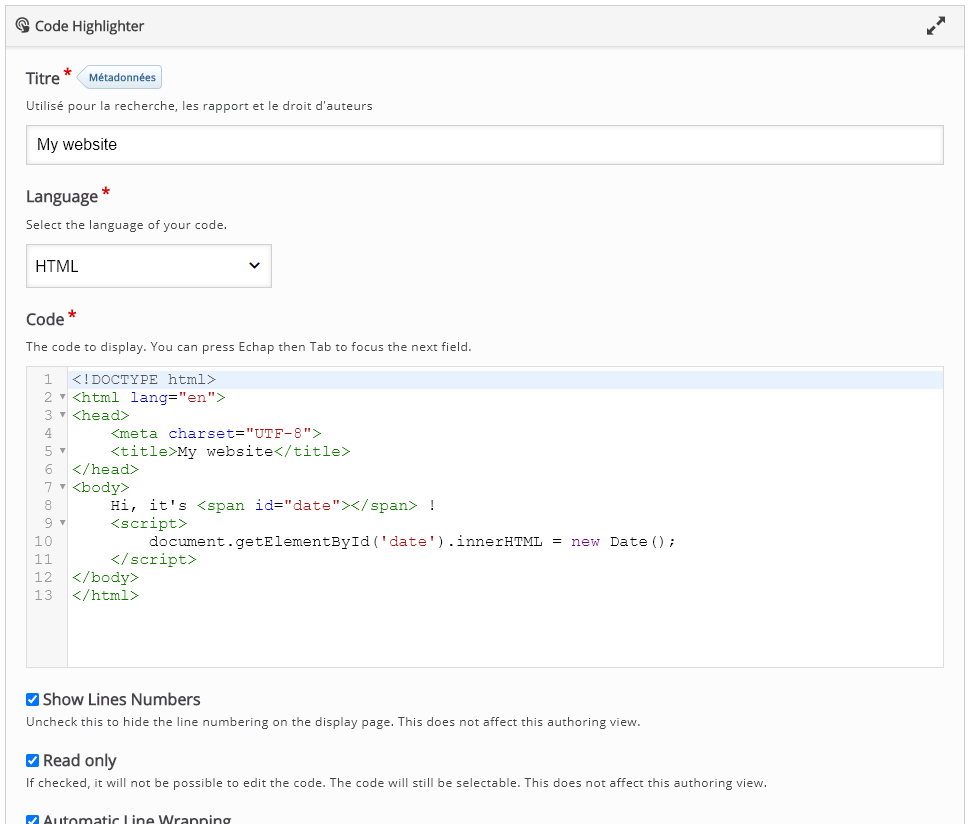
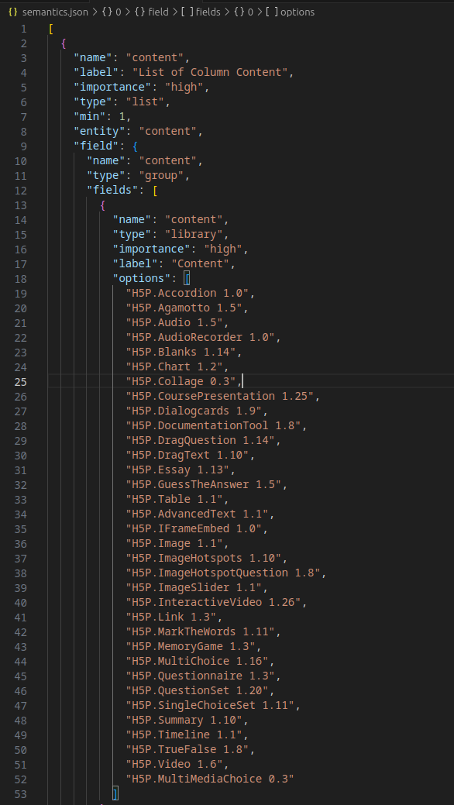
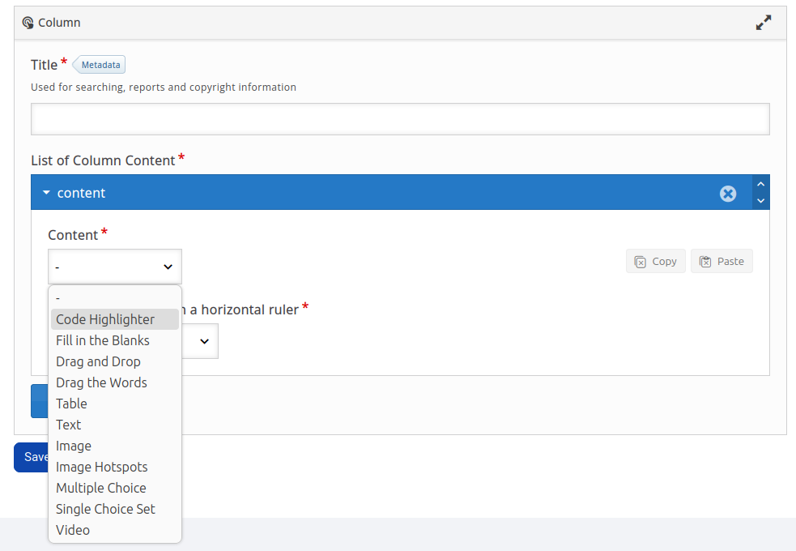

# CodeHighlighter

Esta é uma ferramenta H5P de realce de sintaxe, criada para programadores, desenvolvedores ávidos e entusiastas da programação. Você terá um editor de código onde poderá selecionar a linguagem de programação e inserir códigos com destaque e organização.

**Como integrar esta biblioteca no meu ambiente?**
1. Certifique-se de que as dependências do 'CodeHighlighter' já estão inseridas em seu ambiente: 'CodeMirror' e 'CodeEditor'. Siga a ordem, pois o 'CodeEditor' precisa que o 'CodeMirror' já esteja inserido para funcionar. Aqui estão os repositórios:
    1. CodeMirror: https://github.com/DegrangeM/H5P-CodeMirror
    2. CodeEditor: https://github.com/DegrangeM/H5PEditor.CodeEditor
    3. CodeHighlighter: https://github.com/cte-zl-ifrn/H5P.CodeHighlighter
2. Utilize a interface de linha de comando do H5P (h5pcli), pois é a forma mais eficaz de empacotar um diretório. Exemplo: `h5p pack H5P-CodeMirror/ libray.h5p`. Para mais informações, consulte a documentação da h5pcli: [https://h5p.org/h5p-cli-guide](https://h5p.org/h5p-cli-guide).
3. Após inserir todas as bibliotecas no seu ambiente, você já poderá criar um conteúdo do tipo ‘CodeHighlighter’

**Obs:** Caso queira utilizar o ‘CodeHighlighter’ dentro de outros conteúdos h5p, você deverá integrar o ‘CodeHighlighter’ nesse conteúdo. Por exemplo: “Quero utilizar o ‘CodeHightlighter’ dentro de uma ‘Column’”.
1. Baixando a biblioteca ‘Column’, que pode ser adquirida tanto por linha de comando, como também pelo próprio h5p, nós visualizaremos o seguinte arquivo: `semantics.json` 
2. Este arquivo é responsável por descrever a estrutura de dados da biblioteca, veja: 

1. Perceba que ele lista várias opções de conteúdos H5P, porém, o 'CodeHighlighter' não está listado. Portanto, vamos adicioná-lo aqui: "H5P.CodeHighlighter 1.0", identificando seu 'machinename' e sua versão. Ambas as informações são obtidas do arquivo library.json no diretório do 'CodeHighlighter'. Após isso, integre o novo 'Column' em seu ambiente.
2. Agora, ao criar um 'Column', o nosso 'Code Highlighter' estará disponível. Caso você queira utilizar em um componente diferente que não seja o 'Column', basta seguir o mesmo procedimento, adaptando-o conforme sua necessidade.

